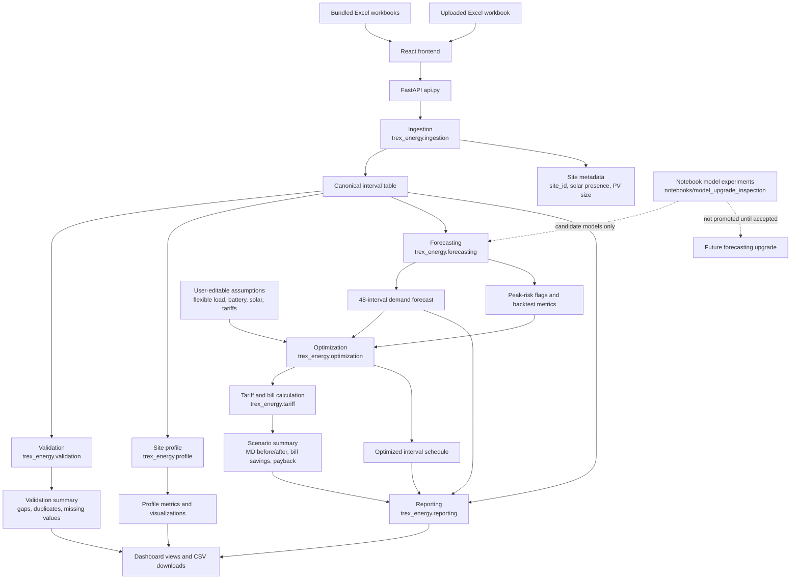

# Mentoring Session Prep

## Purpose

This document prepares the TREX app for a mentoring session by turning the current source-of-truth docs into practical discussion questions and an architecture diagram.

Source documents reviewed:

- `docs/status.md`
- `docs/requirements.md`
- `docs/architecture.md`
- `docs/forecast_model_upgrade_source_of_truth.md`

## Current App Story

TREX is a React/FastAPI decision-support demo for a Malaysia commercial-energy case study. It helps judges and collaborators understand how predictive energy management can reduce electricity costs under higher Maximum Demand charges.

The current app can:

- load the four bundled Excel workbooks as separate site case studies
- accept uploaded `.xlsx` workbooks
- normalize heterogeneous workbook formats into a shared site interval schema
- validate gaps, duplicate timestamps, and interval quality
- forecast the next 48 intervals of `kw_import`
- flag likely peak-risk intervals
- simulate flexible-load shifting, battery dispatch, and solar offset scenarios
- estimate baseline versus optimized bills using MD and energy charges
- export normalized data, forecast outputs, scenario summaries, and bundled site comparisons as CSV files

The main unresolved development risk is forecast quality around actual MD peaks. Notebook experiments have improved peak-alert recall, but the stronger candidates are not yet promoted into the production app because they still need metric review and acceptance.

## Architecture Diagram

## Mental Model For Mentors

The app is not a production energy-management controller yet. It is a judge-facing, explainable decision-support demo.

The important technical chain is:

`Excel data -> normalized site intervals -> demand forecast -> MD peak risk -> scenario simulation -> tariff impact -> recommendation`

The highest-value mentoring feedback should help decide whether the forecasting, optimization, tariff, and storytelling assumptions are credible enough for competition judging.

## Questions To Ask During Mentoring

### Product And Judging

1. What would judges most need to believe for this demo to feel credible: forecast accuracy, cost savings, explainability, or practical deployability?
2. Should the app prioritize a polished judge story or stronger technical model performance for the next development sprint?
3. What is the minimum evidence needed to defend the claim that the app reduces Maximum Demand cost?
4. How should we explain false-positive peak alerts if our strategy intentionally catches more possible MD peaks?
5. Which dashboard view should become the main presentation screen: site comparison, forecast risk, optimization savings, or executive summary?
6. What single recommendation should a judge remember after seeing the app?

### Data And Ingestion

1. Are the four current workbooks definitely separate sites, or could any represent the same site under different periods?
2. Are there official definitions for each site, meter boundary, solar capacity, and billing period?
3. Should workbook filenames remain only hints, or can they be treated as reliable metadata for the competition?
4. How should the app handle non-30-minute gaps: interpolate, mark as missing, exclude periods, or ask the user?
5. What unseen workbook variations are likely during judging or future testing?
6. Do we need manual metadata overrides in the UI for `site_id`, solar presence, and existing PV size?

### Forecasting And Peak Detection

1. Is the current 48-interval horizon the right default for operational decisions, or should it be shorter or longer?
2. Should we optimize for forecast-value accuracy, MD peak recall, peak timing, or a combined score?
3. What peak-alert recall level is good enough for a competition demo if precision drops?
4. Should the notebook-only `enhanced_peak_priority` overlay be promoted into the production app if it improves peak recall but increases false positives?
5. Is the `enhanced_late_peak_uplift` candidate acceptable if it improves overall MD error but barely helps the E-site weakness?
6. Should model complexity remain low and explainable, or is a capped LightGBM quantile path worth another benchmark?
7. What validation split best represents future usage: leave-one-site-out, rolling-origin, or latest-period backtesting?

### Optimization And Control

1. Is the flexible-load-block abstraction acceptable without device-level EV, HVAC, or machinery telemetry?
2. What flexible-load percentage should be used as a realistic default?
3. Should battery dispatch optimize only MD reduction, or include energy arbitrage and solar charging behavior?
4. What battery power and duration ranges are realistic for the sites in scope?
5. Should solar sizing represent new PV only, incremental PV for existing solar sites, or both?
6. What operational constraints are missing from the current deterministic scenario search?

### Tariff, Savings, And Finance

1. Are the MD charge and energy tariff assumptions correct for the competition scenario?
2. What final CAPEX assumptions should be used for battery and solar payback?
3. Should the app show simple payback only, or add NPV, IRR, degradation, and maintenance assumptions?
4. How should partial-month datasets be converted into monthly billing estimates?
5. Should export/import energy, solar self-consumption, and power factor costs be modeled now or deferred?
6. What financial assumptions must be visible in the UI for the outputs to be trusted?

### Dashboard And Reporting

1. Which outputs should be downloadable for presentation: CSV, Excel, PDF, PowerPoint, or all of them eventually?
2. Should the executive summary be generated per site or across all bundled sites?
3. What annotations would make the forecast and optimization charts easier for judges to understand?
4. Should the app include a ranking of best sites for battery, solar, and load shifting?
5. What assumptions should appear near every savings result so the recommendation is not overclaimed?
6. Would a before/after bill waterfall chart make the cost impact clearer than current tables?

### Testing And Delivery

1. Which behavior must never break before the mentoring/demo session?
2. Do we need React/FastAPI smoke tests, screenshot checks, or only unit tests for now?
3. What edge-case uploads should be added to tests beyond the four current workbooks?
4. Should notebook experiments be kept separate, or should accepted model candidates move into package modules?
5. What is the deployment target: local demo, internal server, hosted React/API deployment, or packaged artifact?
6. What is the fallback demo path if upload, forecasting, or optimization fails during the session?

## High-Impact Decisions To Try To Lock

- Final tariff and CAPEX assumptions.
- Accepted forecast evaluation metric and threshold for promotion.
- Whether peak-alert recall is more important than precision for the demo.
- Whether notebook peak-alert work should be promoted into the production app.
- Realistic flexible-load, battery, and solar sizing defaults.
- Primary judge-facing storyline and most important dashboard screen.
- Required export/report format for the final presentation.

## Suggested Session Agenda

1. Confirm the product story and judging priorities.
2. Review the architecture diagram and current app workflow.
3. Validate data assumptions and known workbook limitations.
4. Decide forecast acceptance criteria.
5. Lock tariff, CAPEX, and scenario assumptions.
6. Choose the next development sprint priority.
7. Agree on the demo fallback plan.
